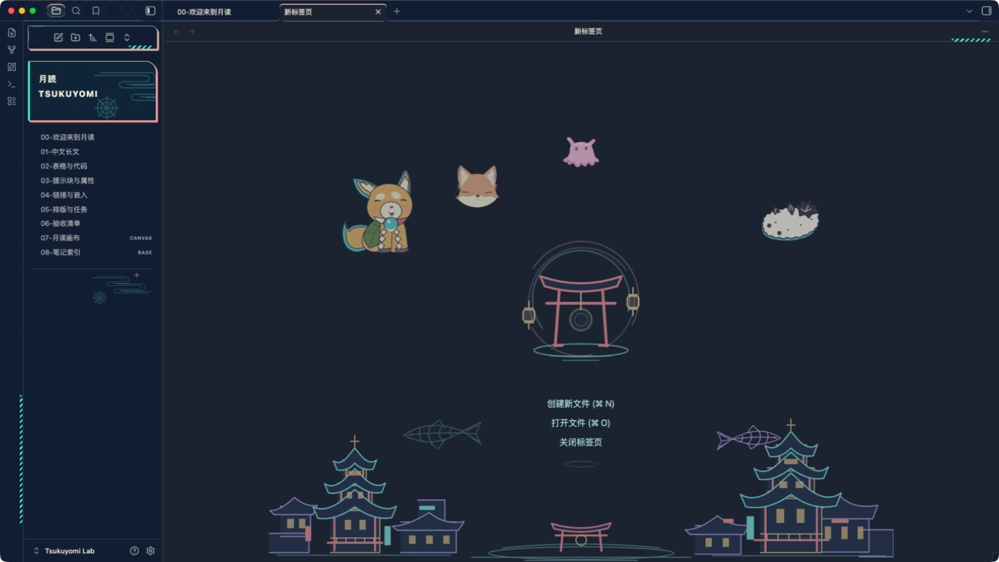

# Tsukuyomi（月读）

Tsukuyomi 是一款受《超时空辉夜姬！》中「月读」空间启发的独立、非官方 Obsidian 主题。v0.7.2 将月读城市与八千代舞台结合：朱红叠檐、暖窗、数字招牌与骨架鱼构成街景，鸟居、圆镜和彩色拱桥组成舞台。提供「月读夜景」与「月白」两种模式。

阅读与编辑区域保持不透明的纯色背景，文件名和笔记标题不叠加纹样、发光或海报卡片。侧栏采用独立的「月読 TSUKUYOMI」灯牌、青绿与珊瑚色偏移边框，以及奶油色选中项。空间足够时，空白页的鸟居与光镜居中，原生操作独立排列在其下方，城市留在底部。导航边缘保留青色短斜线与淡几何纹理。建筑保持静止；骨架鱼弯身、摆尾摆鳍，在下方两侧单向游过后淡出，再由反向鱼接续出现。四位伙伴分散在上方留白：DOGE 在左、FUSHI 在右，粉色伙伴在中央，彩叶狐狸装扮的头部位于中央偏左。狐狸头以官网正面装扮立绘为主要依据，用户截图补充角度参考；粉色伙伴依据用户图片重绘，官方名称尚未确认。角色采用矢量二创，光镜与水波独立变化。简洁模式可关闭招牌、装饰框线与场景。主题不打包官方 PNG、Logo、音乐或字体，不加载远程资源。

主题覆盖阅读视图、实时预览与源码模式，并为工作区、文件树、属性、提示块、代码、表格、搜索、命令面板、Canvas、关系图和 Bases 提供基础配色。主题不会转换或改写笔记内容。安装产物只有 CSS 与清单；游鱼与小角色采用内嵌 SVG 声明式动画，不运行 JavaScript，也不需要动效插件。



[查看狐狸头重绘细节](docs/screenshots/53-fox-detail-v0.7.1.png)。

检查结果与未测项目见 [验收记录](docs/VALIDATION.md)。历史版本的验收结果不代表当前版本已通过相同检查。

[月读空间电影画面参考板](docs/SCENE-REFERENCES.html) 收录六组画面与主题提案，等待用户选择，尚未实施。

## 安装

需要 Obsidian `1.13.7` 或更高版本。

1. 下载或构建 `dist/Tsukuyomi/`。
2. 将整个 `Tsukuyomi` 目录复制到所选库的 `.obsidian/themes/Tsukuyomi/`，确保其中包含 `manifest.json` 和 `theme.css`。
3. 在 Obsidian 打开「设置 → 外观」，将主题切换为 `Tsukuyomi`。

回退时，在「设置 → 外观」重新选择默认主题即可；笔记不会被修改。

## 本地开发

需要 Node.js 22 或更高版本。

```sh
npm ci
npm test
npm run lab
```

`npm ci` 安装两个仅用于开发检查的解析器：`css-tree` 和 `yaml`；主题运行时没有依赖。`npm run build` 只使用 Node.js，将 `src/` 合并为根目录 `theme.css`，并生成 `dist/Tsukuyomi/`。构建时将 `assets/tsukuyomi-{city,gate,fish,fish-swimming,mirror,mascots,mascots-living}.svg` 场景、角色及静态备用图与 `assets/stage-clouds.svg` 云纹内嵌到 CSS；安装时只需清单与样式文件，运行时不请求网络。

`npm run lab` 只会构建并安装到项目内固定的 `lab/Tsukuyomi Lab/`，不接受其他库路径。执行后，在 Obsidian 中通过“打开文件夹作为库”打开这个现有实验库，再从「设置 → 外观」选择 `Tsukuyomi`。

修改鱼形、角色或其动效后，运行 `node scripts/generate-fish.mjs` 和 `node scripts/generate-mascots.mjs` 更新对应 SVG，再运行 `npm test`。粉色伙伴与狐狸头分别由 `scripts/render-mendako.mjs`、`scripts/render-fox.mjs` 的纯函数绘制，仍通过角色生成器更新，无需单独命令。两个生成器输出确定，构建会拒绝与生成结果不一致的旧资产。生成脚本只用于开发，不进入安装产物。CSS 分发文件预算为 `80KiB`，每个解码后的 SVG 不超过 `10KiB`。

本地 CodeGraph 配置用于索引 `scripts/*.mjs`；CSS 源码不在该索引中。

## 可选设置

主题无需插件即可使用。安装社区插件 Style Settings 后，可以调整以下五项：

- `tk-minimal`：简洁模式，默认关闭；启用后隐藏街景招牌、装饰框线与空白页场景。
- `tk-reading-width`：正文最大宽度，默认 `40rem`。
- `tk-density`：标准或紧凑界面密度，默认标准。
- `tk-decoration-opacity`：空白页场景透明度，默认 `0.70`，范围 `0–1`、步长 `0.05`；不调整侧栏招牌。
- `tk-disable-motion`：静态场景，默认关闭；启用后切回静态鱼和角色，并停止光镜、水波及 `140ms` 界面过渡。系统开启减少动态效果时也停止动效。

空白页动效默认可用，无需安装插件；只在空白页为活动窗格且空间足够时播放，切换到其他应用不会由主题主动暂停。建筑、笔记和侧栏招牌保持静止。非活动窗格、系统减少动态效果或「静态场景」使用静态鱼和角色；简洁模式、窄小窗格和打印环境隐藏场景。

升级时，已保存的场景透明度（例如旧版的 `0.10`）会继续生效；可调至 `0.70` 或重置该项。旧 `tk-enable-motion` 已由 `tk-disable-motion` 替代；需要保持静态时，请开启新的「静态场景」。

正文默认行高 `1.75`，保留 Obsidian 与用户选择的字体及字号。升级前笔记中的 `cssclasses: [tk-home]` 可以保留；自 v0.3.0 起不再为它添加特殊首页布局。

另提供两类原创提示块：`[!tsukuyomi]` 和 `[!stage]`。

设计说明见 [docs/DESIGN.md](docs/DESIGN.md)，资料依据见 [docs/SOURCES.md](docs/SOURCES.md)，实际检查范围与未验证项见 [docs/VALIDATION.md](docs/VALIDATION.md)。目前不作移动端实机验证声明。
