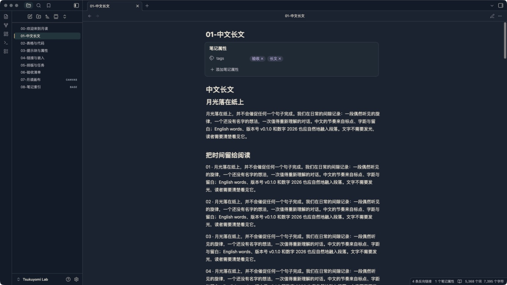
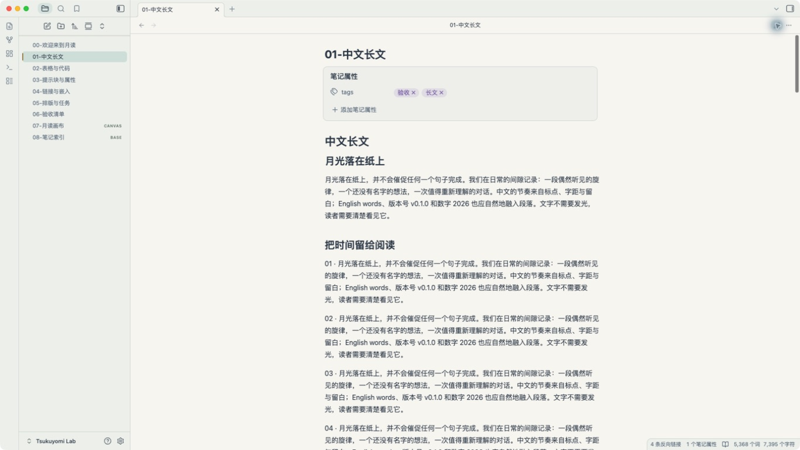

# Tsukuyomi（月读）

Tsukuyomi 是一款受《超时空辉夜姬！》中「月读」空间启发的独立、非官方 Obsidian 主题。v0.3.0 参考制作访谈与场景概念图，以和风夜街的墨蓝屋檐、青绿环境光和暖色灯火组织界面，提供「月读夜景」与「月白」两种模式。

阅读与编辑区域保持不透明的纯色背景，文件列表和标题不叠加纹样、发光或海报卡片。静态灯笼与远檐只出现在空白标签页边缘；可以通过简洁模式关闭。主题不包含人物、官方素材或远程资源。

主题覆盖阅读视图、实时预览与源码模式，并为工作区、文件树、属性、提示块、代码、表格、搜索、命令面板、Canvas、关系图和 Bases 提供基础配色。主题不会转换或改写笔记内容。





检查结果与未测项目见 [验收记录](docs/VALIDATION.md)。历史版本的验收结果不代表当前版本已通过相同检查。

## 安装

需要 Obsidian `1.13.7` 或更高版本。

1. 下载或构建 `dist/Tsukuyomi/`。
2. 将整个 `Tsukuyomi` 目录复制到所选库的 `.obsidian/themes/Tsukuyomi/`，确保其中包含 `manifest.json` 和 `theme.css`。
3. 在 Obsidian 打开「设置 → 外观」，将主题切换为 `Tsukuyomi`。

回退时，在「设置 → 外观」重新选择默认主题即可；笔记不会被修改。

## 本地开发

需要 Node.js 22 或更高版本。

```sh
npm ci
npm test
npm run lab
```

`npm ci` 安装两个仅用于开发检查的解析器：`css-tree` 和 `yaml`；主题运行时没有依赖。`npm run build` 只使用 Node.js，将 `src/` 合并为根目录 `theme.css`，并生成 `dist/Tsukuyomi/`。当前装饰全部由 CSS 绘制，安装时只需清单与样式文件。

`npm run lab` 只会构建并安装到项目内固定的 `lab/Tsukuyomi Lab/`，不接受其他库路径。执行后，在 Obsidian 中通过“打开文件夹作为库”打开这个现有实验库，再从「设置 → 外观」选择 `Tsukuyomi`。

## 可选设置

主题无需插件即可使用。安装社区插件 Style Settings 后，可以调整以下五项：

- `tk-minimal`：简洁模式，默认关闭；启用后隐藏空白页场景与装饰性檐线。
- `tk-reading-width`：正文最大宽度，默认 `40rem`。
- `tk-density`：标准或紧凑界面密度，默认标准。
- `tk-decoration-opacity`：整个空白页静态场景的透明度，默认 `0.10`。
- `tk-enable-motion`：默认关闭。启用后提供 `140ms` 的颜色、边框和阴影过渡；系统开启减少动态效果时不播放。

正文默认行高 `1.75`，保留 Obsidian 与用户选择的字体及字号。升级前笔记中的 `cssclasses: [tk-home]` 可以保留；v0.3.0 不再为它添加特殊首页布局。

另提供两类原创提示块：`[!tsukuyomi]` 和 `[!stage]`。

设计说明见 [docs/DESIGN.md](docs/DESIGN.md)，资料依据见 [docs/SOURCES.md](docs/SOURCES.md)，实际检查范围与未验证项见 [docs/VALIDATION.md](docs/VALIDATION.md)。目前不作移动端实机验证声明。
