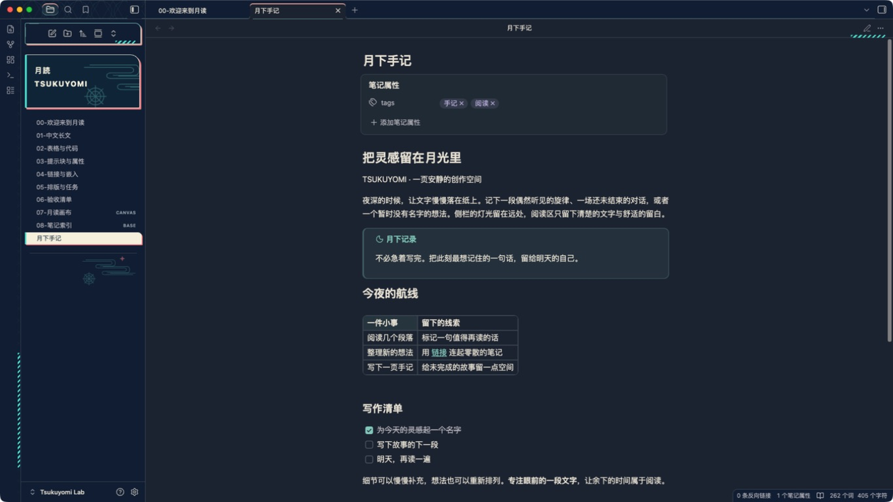

# Tsukuyomi

English · [简体中文](README.zh-CN.md)

An unofficial Obsidian theme inspired by Tsukuyomi from *Cosmic Princess Kaguya!*. **Version 1.0.2** brings ink-blue nights, turquoise lights, and Japanese city scenery to your workspace while keeping reading and writing surfaces calm.

Maintained by [ArisaTaki](https://github.com/ArisaTaki) as an individual fan project.



## Features

- **Dark and light modes** follow Obsidian's appearance setting.
- **Comfortable reading**, including Chinese and mixed-language notes: opaque backgrounds, a default `40rem` line width and `1.75` line height, and your own fonts and font sizes. Supports Reading view, Live Preview, and Source mode.
- **A decorative empty view** with a stationary city and torii, a separate action menu, four vector companions, and swimming skeletal fish. Artwork stays in empty views and workspace edges, away from note text and file names.
- **Offline and self-contained**: installation requires only `theme.css` and `manifest.json`. SVG artwork is embedded, with no runtime JavaScript, network requests, dependencies, or required plugins.

Empty-view previews: [dark](docs/screenshots/55-sidebar-stripe-v0.7.2.jpg) · [light](docs/screenshots/54-fox-native-v0.7.1.jpg). Captured on September 16, 2026 during development; the 1.0 series retains these visuals.

## Installation

Requires **Obsidian 1.13.7 or later**. Available in the [official community directory](https://community.obsidian.md/themes/tsukuyomi). In Obsidian, open **Settings → Appearance → Themes → Manage**, search for **Tsukuyomi**, and install it. You can also use the directory page's **Add to Obsidian** button.

For manual installation:

1. Download `Tsukuyomi-1.0.2.zip` from the [1.0.2 release](https://github.com/kuguya-AI-app-develop/tsukuyomi-Obsidian-theme/releases/tag/1.0.2).
2. Extract the `Tsukuyomi` folder into your vault's `.obsidian/themes/` directory. It should contain `manifest.json` and `theme.css`.
3. In Obsidian, open **Settings → Appearance** and select **Tsukuyomi**.

Alternatively, download the individual `manifest.json` and `theme.css` attachments and place them in `.obsidian/themes/Tsukuyomi/`.

To update, replace both files and reselect the theme. To disable it, select Obsidian's default theme. Your note content is not modified.

## Optional settings

The defaults work without plugins. Install the **Style Settings** community plugin to adjust these five options:

| Setting | Default | Purpose |
| --- | --- | --- |
| Minimal mode | Off | Hide signs, decorative borders, and the empty-view scene |
| Reading width | `40rem` | Adjust the maximum text width |
| Interface density | Standard | Choose standard or compact spacing |
| Scene opacity | `0.70` | Adjust empty-view decoration opacity from `0` to `1` |
| Static scene | Off | Use static fish and companions; stop decorative motion and interface transitions |

Animation plays only in a sufficiently large, active empty pane. System reduced-motion preferences, Static scene, and inactive panes use static artwork. Minimal mode, small panes, and printing hide the scene. Buildings and note content always remain still.

Saved Style Settings values survive upgrades. The old `tk-enable-motion` setting has been replaced by `tk-disable-motion`; enable **Static scene** if you prefer no motion.

## Compatibility

Native application checks were performed with **Obsidian 1.13.7 on macOS**. Windows, Linux, and mobile devices have not been tested. Chinese IME composition, the Style Settings panel, printing/PDF, and long-term performance also have outstanding checks. Default-palette checks do not cover arbitrary custom colors or every third-party plugin.

See the [validation record](docs/VALIDATION.md) for actual checks, screenshots, and limitations.

## Development

Requires Node.js **22.9.0 or later**.

```sh
npm ci
npm test
npm run lint
npm run lab
```

`npm run build` generates the root `theme.css` and `dist/Tsukuyomi/`. `npm run lab` installs only into this project's `lab/Tsukuyomi Lab/` vault. After changing fish or companion artwork, run `node scripts/generate-fish.mjs` or `node scripts/generate-mascots.mjs`, respectively, then run the checks. The build rejects outdated generated assets. Development dependencies are not included in the installed theme.

`npm run lint` uses Obsidian's official Stylelint configuration with documented project compatibility adjustments. See [lint notes](docs/LINT.md). Local checks do not constitute community-directory approval.

## License and artwork

This individual fan project is distributed free of charge through a public GitHub repository on a noncommercial basis, without ads, paid downloads, or donation links. Original software code that the maintainer has rights to license is available under the [MIT License](LICENSE). Third-party character designs, trademarks, and other underlying rights are excluded from that software license.

The project is not affiliated with Obsidian or the original work's rights holders. Companion artwork is fan art; official images, logos, music, and fonts are not bundled with the theme. See [NOTICE](NOTICE.md) for rights and distribution scope, and [sources](docs/SOURCES.md) for references. Research HTML files in `docs/` may load external reference images; they are not used by the installed theme.

[Changelog](CHANGELOG.md) · [Design notes](docs/DESIGN.md) · [Publishing and review status](docs/PUBLISHING.md)
