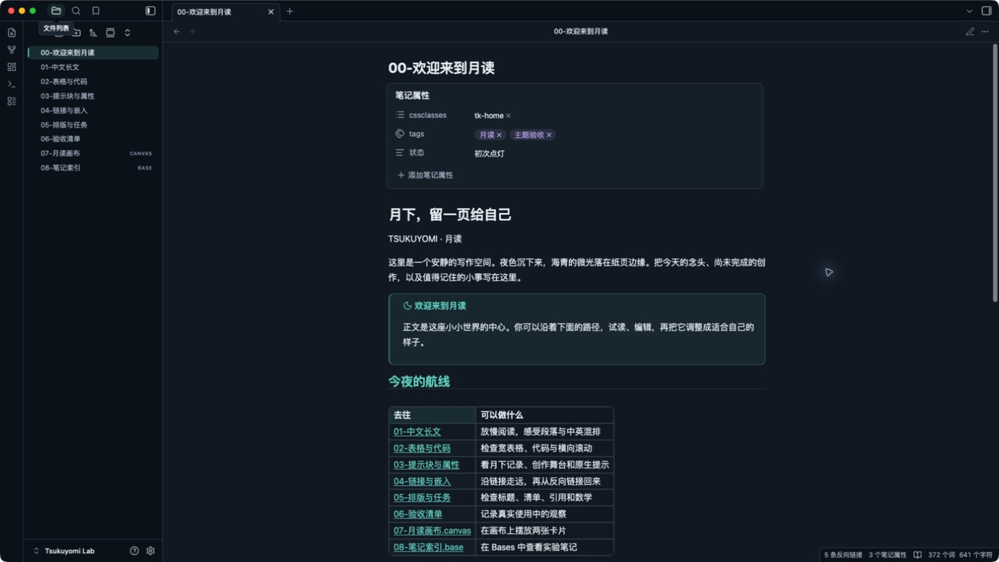

# Tsukuyomi（月读）

Tsukuyomi 是一款受《超时空辉夜姬！》视觉氛围启发的独立、非官方 Obsidian 主题。它以中文阅读和写作为中心，提供「月读夜景」深色模式与「月白」浅色模式，并使用原创 CSS 几何月环作为可关闭的装饰。项目不包含官方图片、Logo、音乐或字体，也不加载远程资源。

主题覆盖阅读视图、实时预览与源码模式，并为工作区、文件树、属性、提示块、代码、表格、搜索、命令面板、Canvas、关系图和 Bases 提供基础配色。主题不会转换或改写笔记内容。



首版已通过自动检查和 macOS 桌面冒烟检查；完整范围与剩余项目见 [验收记录](docs/VALIDATION.md)。

## 安装

需要 Obsidian `1.13.7` 或更高版本。

手动安装：

1. 下载或构建 `dist/Tsukuyomi/`。
2. 将整个 `Tsukuyomi` 目录复制到所选库的 `.obsidian/themes/Tsukuyomi/`，确保其中包含 `manifest.json` 和 `theme.css`。
3. 在 Obsidian 打开「设置 → 外观」，将主题切换为 `Tsukuyomi`。

回退时，在「设置 → 外观」重新选择默认主题即可；笔记不会被修改。

## 本地开发

需要 Node.js 22 或更高版本。

```sh
npm ci
npm test
npm run lab
```

`npm ci` 安装两个仅用于开发检查的解析器：`css-tree` 和 `yaml`；主题运行时没有依赖。`npm run build` 只使用 Node.js，将 `src/` 合并为根目录 `theme.css`，并生成 `dist/Tsukuyomi/`。

`npm run lab` 只会构建并安装到项目内固定的 `lab/Tsukuyomi Lab/`，不接受其他库路径。执行后，在 Obsidian 中通过“打开文件夹作为库”打开这个现有实验库，再从「设置 → 外观」选择 `Tsukuyomi`。

## 可选设置

主题无需插件即可使用。安装社区插件 Style Settings 后，可以调整以下五项：

- `tk-immersive`：沉浸装饰，默认关闭。
- `tk-reading-width`：正文最大宽度，默认 `44rem`。
- `tk-density`：标准或紧凑界面密度。
- `tk-decoration-opacity`：几何装饰强度。
- `tk-enable-motion`：短暂界面过渡，默认关闭并尊重系统的减少动态效果设置。

另提供两类原创提示块：`[!tsukuyomi]` 和 `[!stage]`。

设计说明见 [docs/DESIGN.md](docs/DESIGN.md)，资料依据见 [docs/SOURCES.md](docs/SOURCES.md)，实际检查范围与未验证项见 [docs/VALIDATION.md](docs/VALIDATION.md)。目前不作移动端实机验证声明。
