# Mermaid 图表

检查深浅模式、阅读模式、实时预览，以及手机窄屏：文字应可读，大图应能横向浏览，自定义节点颜色应保留。这里的图均为独立测试样例，不包含参考项目的代码或架构。

## 流程图：分组、中文与多种连线

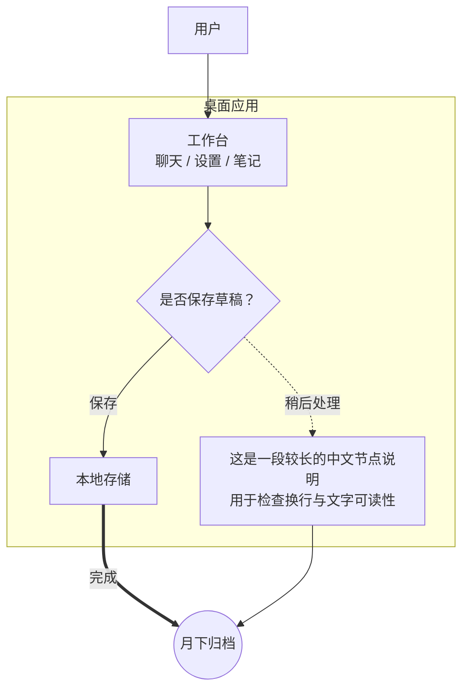

## 小图：避免无必要地放大

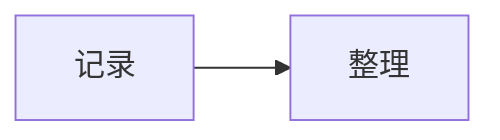

## 大图：横向滚动与末端可达

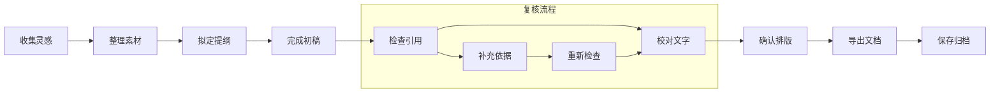

## 时序图

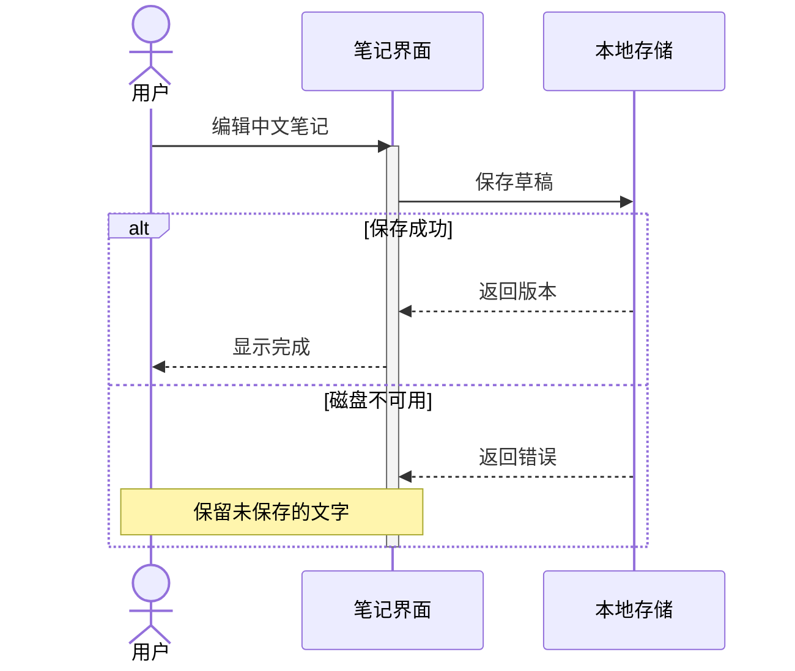

## 类图

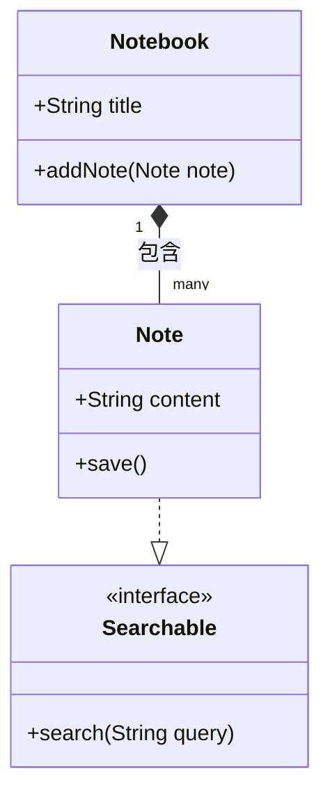

## 状态图

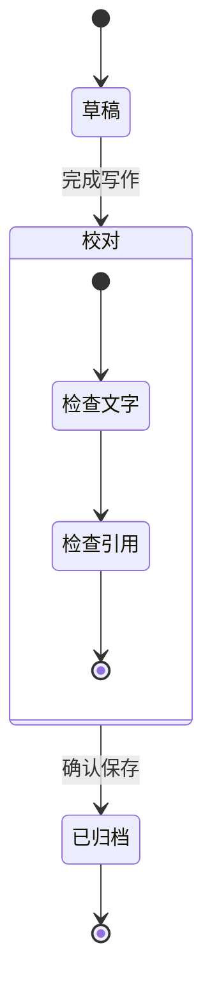

## 实体关系图

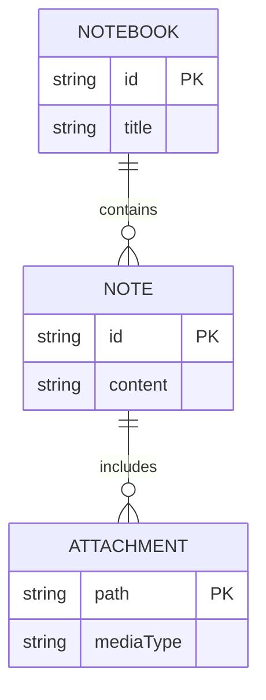

## 显式颜色：主题应尊重作者选择

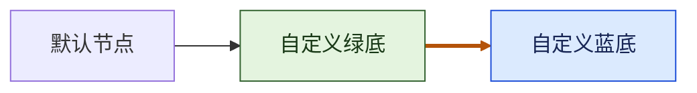

## 图内主题配置

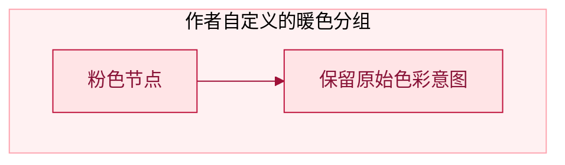

## SVG 文字标签：关闭 HTML 标签

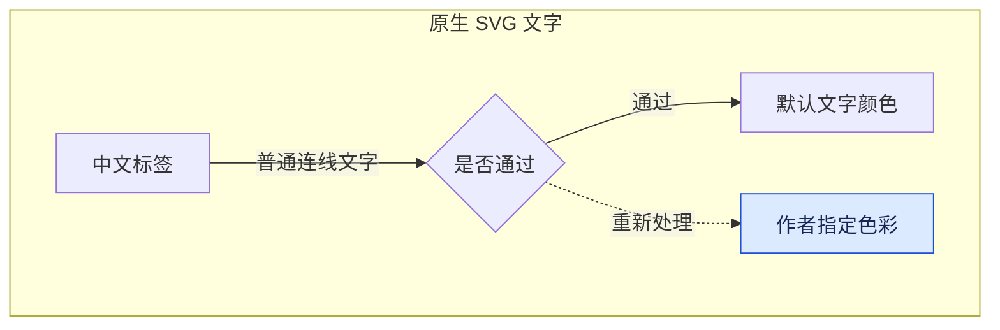

## 状态图：注释、分叉与汇合

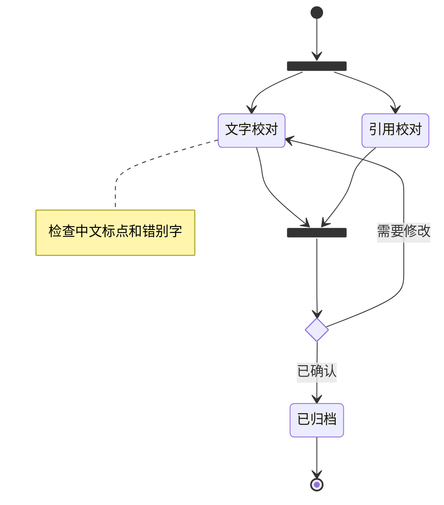

## 只指定背景色：保留默认深色标签

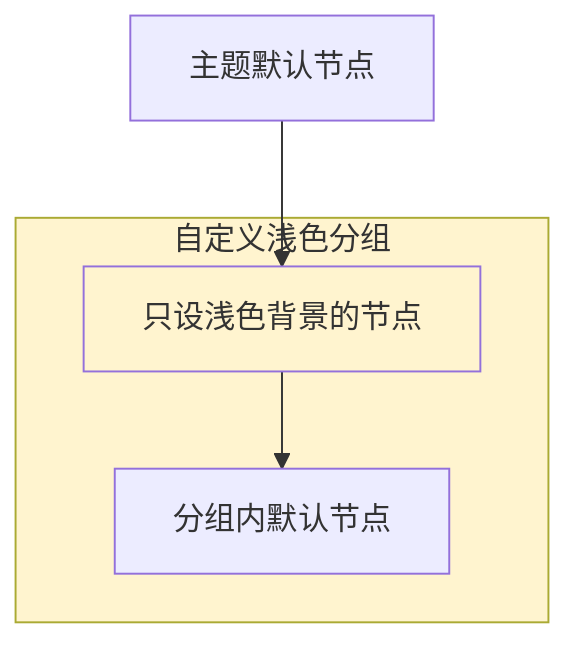

[[00-欢迎来到月读|返回月读]]
